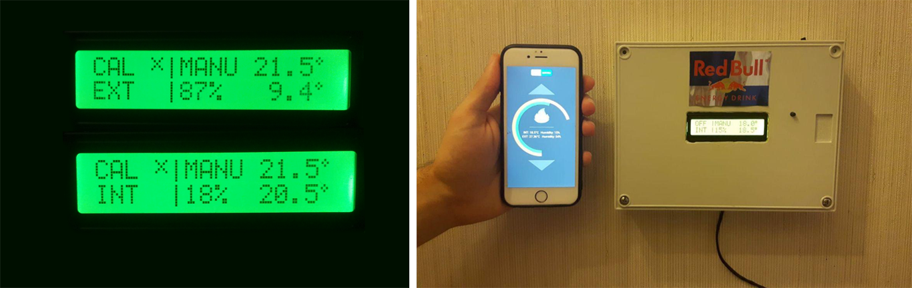
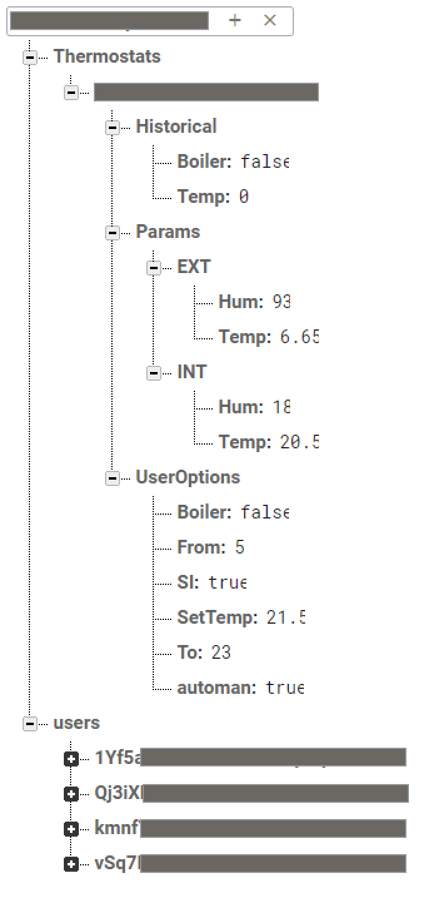

# Smart-Thermostat


Smart-Thermostat is a simple way to control temperature and humidity in your house from your smartphone, you can control thermostats by app <!--[app](linkapp)-->




Thermostat funtions:
* Switch to manual mode for power on/off the boiler
* Switch to automatic mode for setting the temperature that you want
* Show humidity inside your house
* Show outside temperature and humidity
* Automatic reconnection if WiFi disconnect
* Set operating time
* Send email in case of error
* If inside temperature is less than zero switch on boiler to prevent freezing
* OTA Update


## Getting Started

Clone the repository, create firebase account and create a database with this parameters. You can also check out my example server [example server.](https://github.com/SuperCaliMan/SmartThermostat/blob/master/Firebase.json)<br>

<br>Now you can set FIREBASE_HOST and FIREBASE_AUTH. You can find your database secret key in firebase, in this project i used this key to connect my board with firebase, for more details look [here.](https://stackoverflow.com/questions/37418372/firebase-where-is-my-account-secret-in-the-new-console)
Now register in [OpenWeatherMap](https://openweathermap.org) to get weather data and set your key on Weather setup and set Weather Setup parameters. I use [Firebase-Arduino](https://github.com/firebase/firebase-arduino) API to dialog with nodemcu and firebase. I used this library to send email
[Gsender.](http://www.instructables.com/id/ESP8266-GMail-Sender/)
Now you are ready to control temperature and humidity in your house. 


### Parameters setup

```
//Weather Setup
    KEY = "your open weather key";
    COUNTRY = "your country";
    STATE = "your state";   //like: US
    UNITS = "metric";       //imperial
    UTC = 2;

//Firebase connection parameters.
    FIREBASE_HOST "*************.firebaseio.com"
    FIREBASE_AUTH "****************************"

//Wifi connection parameters
    WIFI_SSID "****************"
    WIFI_PASSWORD "************"

Email[] = {
   "your email"
};

```

### Building and component
If you want build this you can watch my wire diagram [here](https://easyeda.com/Cali/thermostat)


## Built With

* [NodeMCU V3.0](https://nodemcu.readthedocs.io/en/master/) - The main board
* [Firebase](https://firebase.google.com/) - Database


## Authors

* **Alberto Caliman** - *Hardware and Firebase* - [AlbertoCaliman](https://github.com/SuperCaliMan)
* **Emanuele Maso** - *Mobile app and Firebase* - [EmanueleMaso](https://github.com/ClarkStoro)

## License

This project is licensed under the MIT License - see the [LICENSE.md](LICENSE.md) file for details
